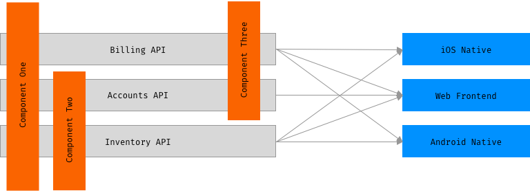

# honeydue-mono-repo

## Understanding the project structure of this monorepo

1. `component-one`, `component-two`, `component-three` are shared components that are used by the teams building out the APIs
2. `accounts-api` depends on `component-one`, `component-two` and `component-three`.  the `accounts-api` is exposed through the `web-frontend` only
3. `billing-api` depends on `component-one`, `component-three` and the `accounts-api`.  the `billing-api` is exposed through all of the frontends - `web-frontend`, `ios-native`, and `android-native`
4. `inventory-api` depends on `component-one`, `component-two`.  the `inventory-api` is exposed through all of the frontends - `web-frontend`, `ios-native`, and `android-native`

---

